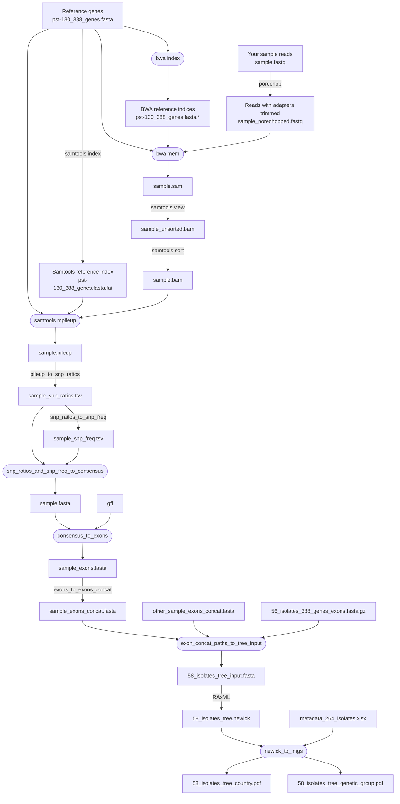

## How it works

```mermaid
flowchart TD
    %% Source files
    FASTQ[Your sample reads\nsample.fastq]
    FASTA[Reference genes\npst-130_388_genes.fasta]
    GFF[gff]
    STARTING_TREE_INPUT[56_isolates_388_genes_exons.fasta.gz]
    METADATA[metadata_264_isolates.xlsx]

    %% Output files
    PORECHOPPED[Reads with adapters trimmed\nsample_porechopped.fastq]
    FASTA_INDEX_FILES_BWA[BWA reference indices\npst-130_388_genes.fasta.*]
    FASTA_INDEX_FILES_SAM[Samtools reference index\npst-130_388_genes.fasta.fai]
    SAM[sample.sam]
    BAM_UNSORTED[sample_unsorted.bam]
    BAM[sample.bam]
    MPILEUP[sample.pileup]
    SNP_RATIOS[sample_snp_ratios.tsv]
    SNP_FREQ[sample_snp_freq.tsv]
    CONSENSUS[sample.fasta]
    EXONS[sample_exons.fasta]
    EXONS_CONCAT[sample_exons_concat.fasta]
    OTHER_EXONS_CONCAT[other_sample_exons_concat.fasta]
    NEW_TREE_INPUT[58_isolates_tree_input.fasta]
    NEW_TREE[58_isolates_tree.newick]
    NEW_TREE_COUNTRY[58_isolates_tree_country.pdf]
    NEW_TREE_GENETIC_GROUP[58_isolates_tree_genetic_group.pdf]

    %% Processes
    BWA_MEM([bwa mem])
    BWA_INDEX([bwa index])
    SAMTOOLS_MPILEUP([samtools mpileup])
    SNP_RATIOS_AND_SNP_FREQ_TO_CONSENSUS([snp_ratios_and_snp_freq_to_consensus])
    CONSENSUS_TO_EXONS([consensus_to_exons])
    EXON_CONCAT_PATHS_TO_TREE_INPUT([exon_concat_paths_to_tree_input])
    NEWICK_TO_IMGS([newick_to_imgs])

    %% Flowchart
    FASTQ -->|porechop| PORECHOPPED
    FASTA --> BWA_MEM
    FASTA --> BWA_INDEX --> FASTA_INDEX_FILES_BWA
    FASTA_INDEX_FILES_BWA --> BWA_MEM
    PORECHOPPED --> BWA_MEM --> SAM
    SAM -->|samtools view| BAM_UNSORTED
    BAM_UNSORTED -->|samtools sort| BAM
    FASTA -->|samtools index| FASTA_INDEX_FILES_SAM
    FASTA --> SAMTOOLS_MPILEUP
    FASTA_INDEX_FILES_SAM --> SAMTOOLS_MPILEUP
    BAM --> SAMTOOLS_MPILEUP --> MPILEUP
    MPILEUP -->|pileup_to_snp_ratios| SNP_RATIOS
    SNP_RATIOS -->|snp_ratios_to_snp_freq| SNP_FREQ
    SNP_RATIOS --> SNP_RATIOS_AND_SNP_FREQ_TO_CONSENSUS
    SNP_FREQ --> SNP_RATIOS_AND_SNP_FREQ_TO_CONSENSUS --> 
    CONSENSUS --> CONSENSUS_TO_EXONS
    GFF --> CONSENSUS_TO_EXONS
    CONSENSUS_TO_EXONS --> EXONS
    EXONS -->|exons_to_exons_concat| EXONS_CONCAT
    EXONS_CONCAT --> EXON_CONCAT_PATHS_TO_TREE_INPUT
    OTHER_EXONS_CONCAT --> EXON_CONCAT_PATHS_TO_TREE_INPUT
    STARTING_TREE_INPUT --> EXON_CONCAT_PATHS_TO_TREE_INPUT
    EXON_CONCAT_PATHS_TO_TREE_INPUT --> NEW_TREE_INPUT
    NEW_TREE_INPUT -->|RAxML| NEW_TREE
    NEW_TREE --> NEWICK_TO_IMGS
    METADATA --> NEWICK_TO_IMGS
    NEWICK_TO_IMGS --> NEW_TREE_COUNTRY
    NEWICK_TO_IMGS --> NEW_TREE_GENETIC_GROUP
```